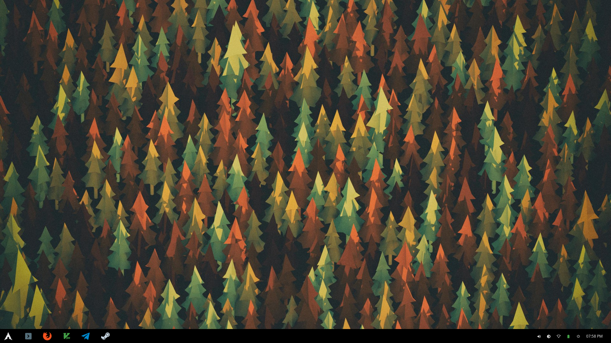
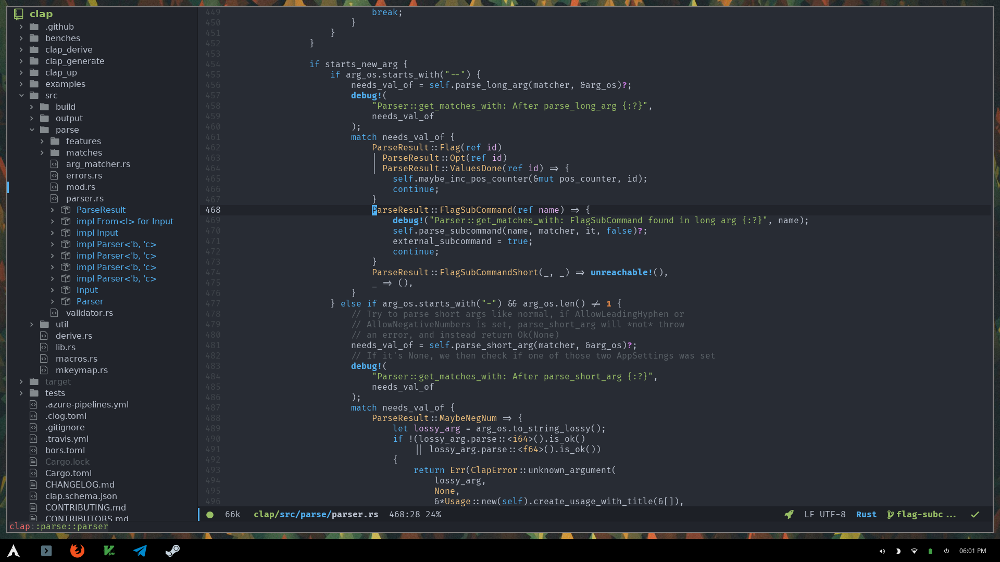
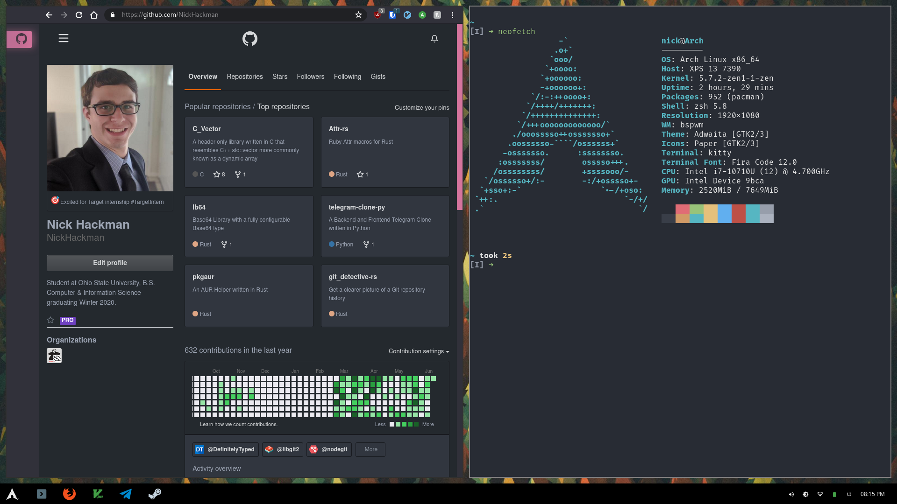

# Dotfiles

These are my personal configuration files, they're simple I'll admit, but simple is what I like.

## 📷 Screenshots

### Clean

### Work

### Dirty

## Applications

- [doom-emacs](https://github.com/hlissner/doom-emacs)
- [exa](https://github.com/ogham/exa)
- [bat](https://github.com/sharkdp/bat)
- [ripgrep](https://github.com/BurntSushi/ripgrep)
- [fd](https://github.com/sharkdp/fd)
- [polybar](https://github.com/polybar/polybar)
- [bspwm](https://github.com/baskerville/bspwm)
- [sxhkd](https://github.com/baskerville/sxhkd)
- [rofi](https://github.com/davatorium/rofi)
- [zsh](http://www.zsh.org/)
- [kitty](https://github.com/kovidgoyal/kitty)

## 🗛 Fonts

- [fira-code](https://github.com/tonsky/FiraCode)
- [noto-sans](https://www.google.com/get/noto/)
- [Material Design Icons](https://github.com/Templarian/MaterialDesign)
- [Iosevka Nerd Font](https://github.com/ryanoasis/nerd-fonts)

## ❤️ Thanks

- Polybar config based off [polybar-themes](https://github.com/adi1090x/polybar-themes#-polybar-10--dedistro-panels) by @adi1090x
- Doom Emacs is wonderful! Thanks @hlissner

## License

Licensed under [GPLv3](./LICENSE)
