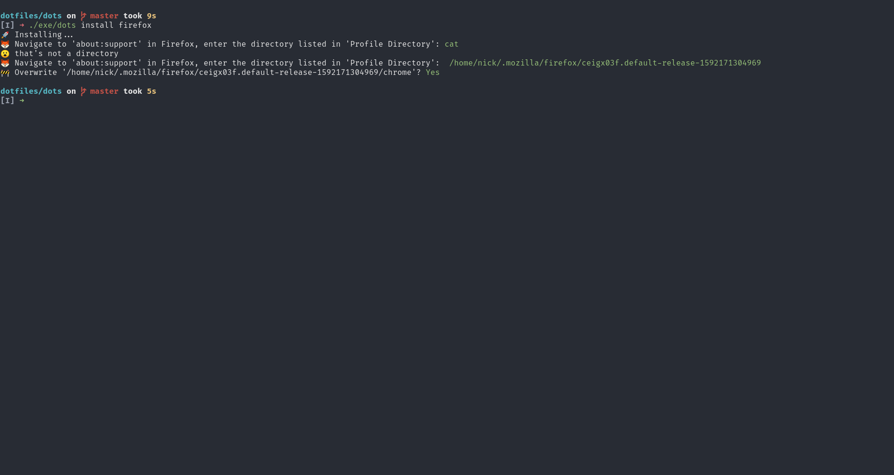
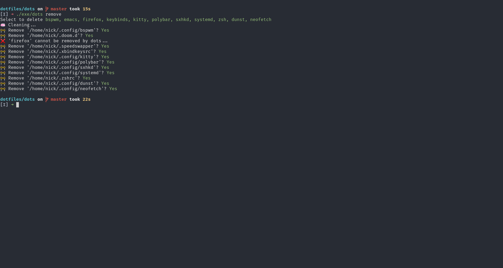

# Dots

This README and Dots as a whole are a work in progress 👨‍💻

## ⚾ Pitch

The purpose of Dots is to make startup time on a new machine as short as possible as well as keeping your systems synchronized and having a continuous experience of what you know you love, **dead simple**.

## ✨ Features

- Install dotfiles as symlinks or copies
- List all installed dotfiles
- Easy cleanup of installed dotfiles
- Doctor to show what dependencies you're missing **WIP**
- Clean and simplistic design

## 💎 Install Ruby

Follow Ruby's official [installation instructions](https://www.ruby-lang.org/en/documentation/installation/)

## 📷 Screenshots

### ⬆️ Install All

Installation with selection of any dotfiles

### 🦊 Install Firefox CSS

Installation with provided command line argument

### 🏥 Doctor

Doctor for all dotfiles

### ⬇️ Remove all

Uninstall all dotfiles

## ⚖️ License

Licensed under [GPLv3](LICENSE)
